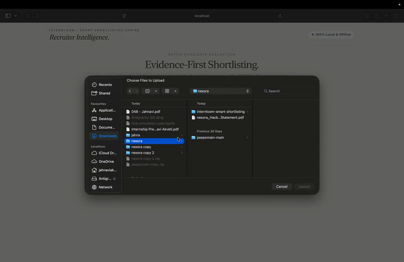
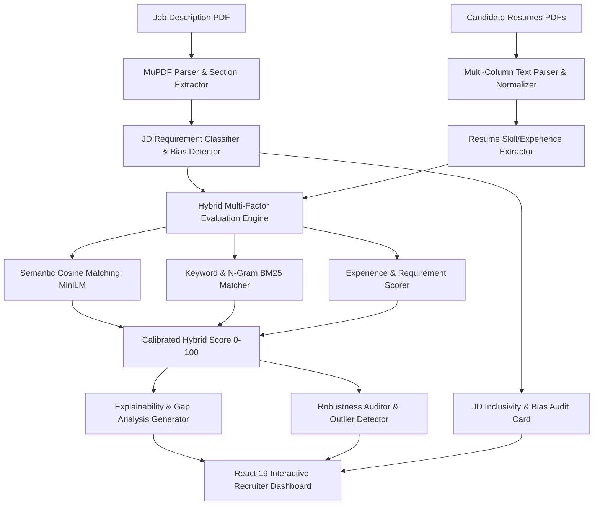

# 🌟 Nexora — InternLoom Smart Shortlisting Engine
### *AI-Powered Multimodal Resume-to-Job Matching, Bias Auditing & Explainable Shortlisting Suite*

[](https://www.python.org/)
[](https://fastapi.tiangolo.com/)
[](https://react.dev/)
[](https://pytest.org/)
[](https://huggingface.co/sentence-transformers/all-MiniLM-L6-v2)
[](LICENSE)

---

## 🎬 Live Demo & Video Walkthrough



> 📹 **Watch Full Walkthrough Video**: [`assets/demo_walkthrough.mp4`](./assets/demo_walkthrough.mp4)  
> 📄 **Executive PDF Summary**: [`hackathon_information/Project_Summary_1Page.pdf`](./hackathon_information/Project_Summary_1Page.pdf)  
> 📑 **Full Technical Report**: [`hackathon_information/Nexora_Brocode_Project_Summary_Report.pdf`](./hackathon_information/Nexora_Brocode_Project_Summary_Report.pdf)

---

## 📌 Executive Summary

**Nexora (Team Brocode)** delivers **InternLoom Smart Shortlisting Engine**, an enterprise-grade recruiting intelligence platform designed to replace opaque keyword-based applicant tracking systems (ATS). By combining **semantic vector embeddings**, **hybrid multi-factor scoring**, **automated explainability**, **ranking robustness auditing**, and **proactive job description inclusivity/bias detection**, Nexora provides recruiters with transparent, calibrated, and equitable shortlisting recommendations in seconds.

---

## 🚀 Key System Highlights



---

## 💡 Core Capabilities & Innovation

### 1. 📄 Robust Multimodal Document Parsing
- High-fidelity PDF extraction via **PyMuPDF / pdfplumber** handling single/multi-column layouts, tabular resume blocks, and irregular headings.
- Deterministic section detection (Education, Experience, Skills, Projects, Certifications) with smart whitespace and Unicode normalization.

### 2. 🧠 Hybrid Multi-Factor Evaluation Engine
Nexora avoids simplistic keyword counts by computing a calibrated multi-dimensional match score:
$$\text{Score} = w_{\text{req}} S_{\text{req}} + w_{\text{pref}} S_{\text{pref}} + w_{\text{exp}} S_{\text{exp}} + w_{\text{sem}} S_{\text{sem}} + w_{\text{key}} S_{\text{key}} - \text{Penalties}$$
- **Required Requirements Weight**: 35%
- **Preferred Qualifications Weight**: 15%
- **Experience Duration & Depth Weight**: 20%
- **Semantic Vector Alignment (`all-MiniLM-L6-v2`)**: 20%
- **Direct Keyword & Technical Skill Overlap**: 10%

### 3. 🛡️ Bonus Task 1: Job Description Inclusivity & Bias Detector
Nexora automatically audits job postings before candidate ranking to eliminate barriers to diverse talent:
- **5 Bias Classifications**:
  1. 🚻 **Gender-Coded / Hyper-Aggressive Terms** (e.g., *"rockstar"*, *"ninja"*, *"aggressive closer"*)
  2. 🎓 **Pedigree & Tier-1 Degree Locks** (e.g., *"IIT/NIT/Ivy League only"*, *"top-tier university graduates"*)
  3. ⏳ **Unrealistic Experience Ceilings** for entry/intern roles (e.g., *"5+ years required for junior intern"*)
  4. 🎂 **Age & Generational Markers** (e.g., *"digital native"*, *"young energetic team"*)
  5. ♿ **Ableist & Non-Essential Physical Demands** (e.g., *"stand for 8 hours"* on software roles)
- **Scoring & Feedback**: 0–100 Inclusivity Score, Letter Grade (A+ through F), highlighted contextual snippets, and direct **Inclusive Alternatives**.

### 4. 🔍 Explainability & Gap Analysis Engine
- Generates **plain-language hiring justifications** for every candidate.
- Highlights exact **Matched Strengths** and **Critical Missing Requirements**.
- Provides candidate-specific interview prompt suggestions based on detected experience gaps.

### 5. 🏆 Interactive Recruiter Experience (React 19 + Vite)
- **Top-3 Podium Cards** for instant visual identification of best-fit candidates.
- **Dynamic Candidate Inspection Modal** with side-by-side match breakdown, radial score gauges, and evidence snippets.
- **Live Search, Filter & CSV Export** for streamlined recruiting workflows.

---

## 📂 Repository Structure

```
nexora/
├── backend/                       # FastAPI backend service
│   ├── app/
│   │   ├── api/routes/            # API endpoints (/api/v1/analyze, /health)
│   │   ├── core/                  # Configuration & CORS settings
│   │   ├── schemas/               # Pydantic v2 schemas (bias, api, analysis)
│   │   └── services/              # Core algorithms
│   │       ├── document_parser/   # PDF parsing & text normalization
│   │       ├── jd_analyzer/       # Requirement extractor & Bias Detector
│   │       ├── resume_analyzer/   # Candidate profile & experience extractor
│   │       ├── semantic_matcher/  # MiniLM embedding similarity
│   │       ├── keyword_matcher/   # Skill & token matching
│   │       ├── hybrid_evaluator/  # Multi-factor score computation
│   │       ├── explanation_engine/# Structured explainability & gap analysis
│   │       └── robustness_auditor/# Outlier & ranking stability auditor
│   ├── tests/                     # 159 comprehensive unit & integration tests
│   ├── requirements.txt           # Python dependencies
│   └── pytest.ini                 # Pytest configuration
├── frontend/                      # React 19 + Vite dashboard
│   ├── src/
│   │   ├── App.jsx                # Recruiter dashboard with Inclusivity widget
│   │   ├── App.css                # Premium modern UI design system
│   │   └── main.jsx               # React entry point
│   ├── package.json               # Frontend dependencies & scripts
│   └── vite.config.js             # Vite development & build config
├── data/                          # Datasets & evaluation samples
│   ├── testing_dataset/           # Official hackathon sample JD & 18 candidate resumes
│   └── dummy_resumes/             # Multidisciplinary candidate resumes
├── hackathon_information/         # Official hackathon prompts & summary PDFs
│   ├── nexora_Hackathon_Problem_Statement.pdf
│   ├── Nexora_Brocode_Project_Summary_Report.pdf
│   ├── Project_Summary_1Page.pdf
│   ├── generate_summary_pdf.py
│   └── generate_1page_summary_pdf.py
├── assets/                        # Walkthrough video, GIF, and thumbnails
│   ├── demo_preview.gif
│   ├── demo_thumbnail.png
│   └── demo_walkthrough.mp4
├── docs/                          # Comprehensive technical documentation
│   ├── architecture.md
│   ├── hybrid_scoring.md
│   ├── explainability.md
│   └── local_web_app.md
└── README.md                      # Project documentation
```

---

## ⚡ Quickstart Guide

### Prerequisites
- **Python 3.11+**
- **Node.js 18+** & **npm**

---

### 1. Start Backend (FastAPI)

```bash
cd backend

# Create and activate virtual environment
python3 -m venv venv
source venv/bin/activate       # On Windows: venv\Scripts\activate

# Install dependencies
pip install -r requirements.txt

# Run FastAPI backend
uvicorn app.main:app --host 127.0.0.1 --port 8000 --reload
```
> Backend API Swagger Docs: `http://127.0.0.1:8000/docs`  
> Health Check: `http://127.0.0.1:8000/health`

---

### 2. Start Frontend (React + Vite)

In a new terminal window:

```bash
cd frontend

# Install packages
npm install

# Start Vite dev server
npm run dev
```
> Open browser at `http://127.0.0.1:5173`

---

### 3. Run Automated Tests

To execute the entire 159-test test suite:

```bash
cd backend
source venv/bin/activate
pytest
```

**Output**:
```text
======================== 159 passed in 48.72s ========================
```

---

## 📊 Evaluation & Sample Testing

1. Launch the frontend dashboard at `http://localhost:5173`.
2. Drag and drop the Job Description from `data/testing_dataset/Sample_JD.pdf`.
3. Select all 18 candidate resumes from `data/testing_dataset/Testing Dataset/`.
4. Click **"Analyze Resumes with AI Engine"**.
5. View:
   - **Job Inclusivity & Bias Audit Pill** (Score & Grade breakdown).
   - **Podium Best Matches** (Top 3 candidates).
   - **Ranked Candidates Table** with overall score, semantic score, and required qualifications met.
   - Click **"Inspect"** on any candidate for deep explainability breakdown and gap analysis.

---

## 👥 Team Brocode — Nexora Hackathon

- **Team**: Brocode
- **Project**: Nexora / InternLoom Smart Shortlisting Engine
- **Repository**: [https://github.com/DreamX55/Nexora-Brocode](https://github.com/DreamX55/Nexora-Brocode)
